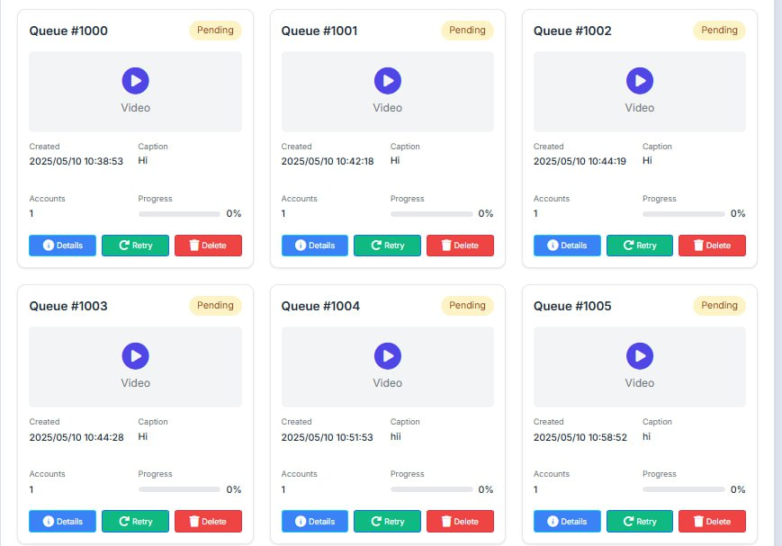

# Instagram Automation Platform


A powerful Django-based platform for Instagram automation with Docker support. This platform helps you automate your Instagram activities while maintaining account safety through proxy support.

## 📸 Screenshots

### Automation Interface


### Queue Management


## Features

- Login instagram accounts
- User authentication and management
- Instagram automation capabilities
- File upload and processing
- Queue management system
- Docker containerization
- MongoDB database
- Redis for caching and task queue
- MinIO for file storage
- Proxy support for Instagram automation

## 🚀 Quick Start Guide

### 1. Prerequisites
- Docker Desktop installed and running
- Git installed
- Python 3.9+ (for local development)
- Proxy service subscription (recommended: IPRoyal or SOAX)

### 2. Installation Steps

#### Clone the Repository
```bash
git clone https://github.com/yourusername/instagram-automation.git
cd instagram-automation
```

#### Configure Environment
1. Copy the example environment file:
```bash
cp .env.example .env
```

2. Edit the `.env` file with your credentials:
```env
# Add your proxy credentials
PROXY_USERNAME=your_proxy_username
PROXY_PASSWORD=your_proxy_password
PROXY_HOST=your_proxy_host
PROXY_PORT=your_proxy_port

# Add other required credentials
OPENAI_API_KEY=your_openai_key
WORLD_NEWS_API_KEY=your_news_api_key
```

#### Start the Application
```bash
# Build and start all services
docker-compose up --build -d

# Check if all services are running
docker-compose ps
```

### 3. Access the Platform
- Web Interface: http://localhost:8025
- MinIO Console: http://localhost:9020
- Default Admin Credentials:
  - Username: admin
  - Password: admin123

### 4. First-time Setup
1. Log in to the admin panel
2. Change the default admin password
3. Configure your Instagram accounts
4. Set up your automation rules
5. Start your automation tasks

## Docker Services

The application consists of the following services:

- **Django**: Main application server (port 8025)
- **MongoDB**: Database server (port 27020)
- **Redis**: Cache and task queue (port 6379)
- **MinIO**: Object storage (ports 9022, 9020)
- **Celery**: Background task processor

## Environment Variables

Create a `.env` file with the following variables:

```env
SERVER=127.0.0.1:8000
MinioSERVER=minio:9000
MongoSERVER=my-mongo

# Redis Configuration
CELERY_BROKER_URL=redis://:P@ssw0rd@redis:6379/0
CELERY_RESULT_BACKEND=redis://:P@ssw0rd@redis:6379/0

# MongoDB Configuration
MONGO_HOST=my-mongo
MONGO_PORT=27017
MONGO_INITDB_ROOT_USERNAME=admin
MONGO_INITDB_ROOT_PASSWORD=secretpassword
MONGO_DATABASE=josef

# MinIO Configuration
MINIO_HOST=minio:9000
MINIO_ACCESS_KEY=minioadmin
MINIO_SECRET_KEY=miniosecret
MINIO_BUCKET_NAME=josef
MINIO_USE_SSL=false

# Proxy Configuration (Required for Instagram Automation)
PROXY_USERNAME=your_proxy_username
PROXY_PASSWORD=your_proxy_password
PROXY_HOST=your_proxy_host
PROXY_PORT=your_proxy_port

# OpenAI Configuration
OPENAI_API_KEY=YOUR_OPENAI_API_KEY

# World News API Configuration
WORLD_NEWS_API_KEY=YOUR_WORLD_NEWS_API_KEY
```

## Development

1. Create a virtual environment:
```bash
python -m venv venv
source venv/bin/activate  # On Windows: venv\Scripts\activate
```

2. Install dependencies:
```bash
pip install -r requirements.txt
```

3. Run migrations:
```bash
python manage.py migrate
```

4. Start the development server:
```bash
python manage.py runserver
```

## 📁 Project Structure

```
instagram-automation/
├── Django/              # Django project settings
│   ├── settings.py     # Project configuration
│   └── urls.py         # URL routing
├── Data_Manager/       # Data management modules
│   ├── models.py       # Database models
│   └── views.py        # View logic
├── templates/          # HTML templates
│   ├── base.html      # Base template
│   └── dashboard.html  # Dashboard template
├── static/            # Static files
│   ├── css/          # Stylesheets
│   ├── js/           # JavaScript files
│   └── images/       # Image assets
├── fonts/            # Custom fonts
├── docker-compose.yml # Docker services configuration
├── Dockerfile        # Django container setup
├── requirements.txt  # Python dependencies
└── README.md        # Documentation
```

## 🔒 Security Best Practices

1. **Proxy Management**
   - Use residential proxies for better success rates
   - Rotate proxy IPs every 24-48 hours
   - Monitor proxy performance and switch if needed

2. **Account Safety**
   - Start with low automation limits
   - Gradually increase activity levels
   - Monitor account status regularly
   - Use different proxies for different accounts

3. **Environment Security**
   - Never commit `.env` files
   - Use strong passwords
   - Enable 2FA where possible
   - Regular security audits

## Contributing

1. Fork the repository
2. Create your feature branch (`git checkout -b feature/amazing-feature`)
3. Commit your changes (`git commit -m 'Add some amazing feature'`)
4. Push to the branch (`git push origin feature/amazing-feature`)
5. Open a Pull Request

## License

This project is licensed under the GNU AFFERO GENERAL PUBLIC LICENSE License - see the LICENSE file for details.